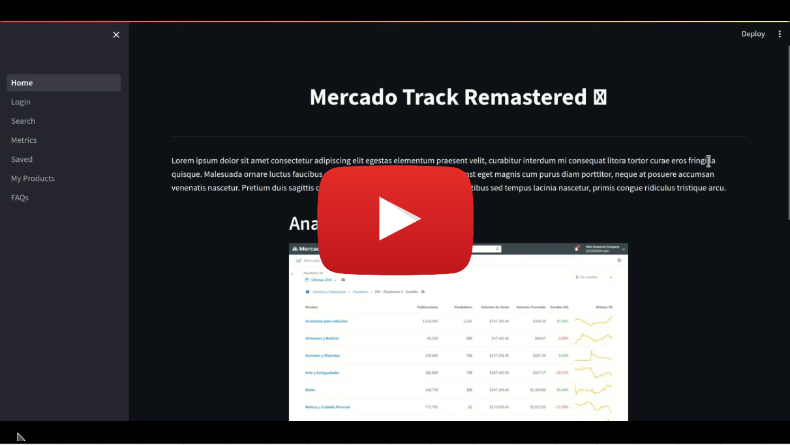

<h1 align="center">MercadoLibre Analysis Tool</h1>

<h2>Introduction</h2>
This is a frontend made in python using the streamlit module, it was used only for testing, as a backend I used aws services such as: APIgateway, lambda, RDS, S3, eventBridge.

<h2>Deployment</h2>
<pre>
#create a virtual enviroment
python3 -m venv venv
#install dependencies
pip install -r ./front/requirements.txt
#run the webserver
streamlit run ./front/Home.py
</pre>

